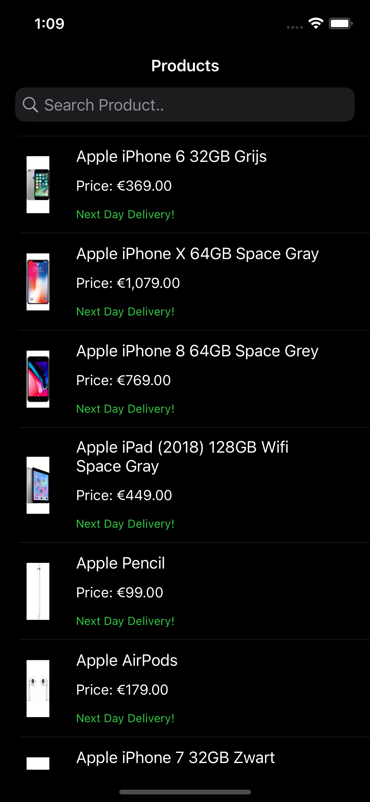
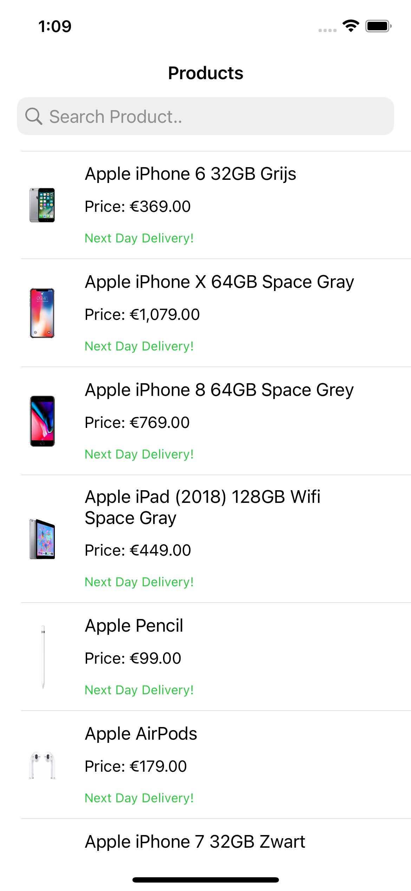

# ShoppingApp

A shopping application to list products and search a product from [Amazon API](https://bdk0sta2n0.execute-api.eu-west-1.amazonaws.com/mobile-assignment/search?page=1).

## About
- MVVMC is used for the design structure.
- Swift Package Manager is used to manage dependencies.
- [SDWebImage](https://github.com/SDWebImage/SDWebImage) is used to load images asynchronously.
- [Alamofire](https://github.com/Alamofire/Alamofire) used as HTTP Client.

## Modules
- `Service` module is used to abstract the data provider layer.

## Screenshots
| Dark Mode | Light Mode |
|:---------:|:----------:|
|  |  |
